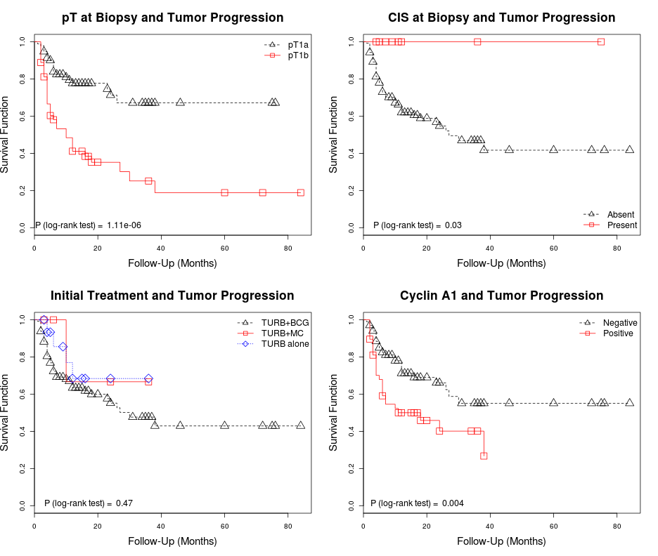

## Cyclin A1 Expression in pT1 Urothelial Carcinoma of Bladder
* Opening & attaching dataset and loading functions & libraries

```r
ca1 <- read.csv("../ca1.csv")
attach(ca1)
```

```
## The following objects are masked from ca1 (position 6):
## 
##     ca1.extension, ca1.extenstion.intensity, ca1.positive.0,
##     ca1.positive.10, caseid, cis.biopsy, dx.final, dx.followup,
##     follow.up, progression, pt.biopsy, recurrence,
##     recurrence.groups, recurrence.more1, recurrence.number,
##     time.event, treatment
```

```r
library(psych) # For descriptive statistics
library(survival) # For Survival Analyses
source("../standardAnalysis.R")
source("../SurvivalPlot.R")
```
### Describing the Data

```r
# pT1 at Biopsy
table.prop(pt.biopsy)
```

```
##      Count Percentages
## pT1a    95        63.8
## pT1b    54        36.2
```

```r
# CIS at Biopsy
table.prop(cis.biopsy) 
```

```
##     Count Percentages
## No    140          94
## Yes     9           6
```

```r
# Initial Treatment
table.prop(treatment)
```

```
##      Count Percentages
## BCG    128        85.9
## MCC      5         3.4
## TURB    16        10.7
```

```r
# Recurrence ratio
table.prop(recurrence)
```

```
##   Count Percentages
## 0    49        32.9
## 1   100        67.1
```

```r
# Distribution of TNM stages
table.prop(dx.final) 
```

```
##          Count Percentages
## M1          17        11.4
## pT1         22        14.8
## pT2         20        13.4
## pT3         11         7.4
## pT4          6         4.0
## pTa/pTis    24        16.1
## <NA>        49        32.9
```

```r
# Describing the number of recurrence episodes
descriptive(recurrence.number) 
```

```
##        Values
## Mean      2.0
## SD        2.6
## Median    1.0
## IQR       1.0
```

```r
# Recurrence episodes by groups
table.prop(recurrence.groups) 
```

```
##      Count Percentages
## 1       59        39.6
## 2       22        14.8
## 3       14         9.4
## >3       5         3.4
## <NA>    49        32.9
```

```r
# Describing the % of cyclin A1 expression
descriptive(ca1.extension)
```

```
##        Values
## Mean      9.1
## SD        6.9
## Median    8.0
## IQR       8.3
```

```r
# % Cyclin A1 Positivity
table.prop(ca1.positive.10)
```

```
##          Count Percentages
## Negative   101        67.8
## Positive    48        32.2
```

### Table 1: Cyclin A1 Immunohistochemical Expression in 149 Invasive High-Grade Urothelial Carcinomas by Pathologic Features and Outcome

```r
# Cyclin A1 by pT at Biopsy
compare.fisher(pt.biopsy, ca1.positive.10)
```

```
## **Table of Frequencies**
##       Column
## Row    Negative Positive
##   pT1a       71       24
##   pT1b       30       24
## 
## **Row Percentages**
##       Column
## Row    Negative Positive
##   pT1a       75       25
##   pT1b       56       44
## 
## **Column Percentages**
##       Column
## Row    Negative Positive
##   pT1a       70       50
##   pT1b       30       50
## 
## Fisher's P value = 0.01864
```

```r
# Cyclin A1 by CIS at Biopsy
compare.fisher(cis.biopsy, ca1.positive.10)
```

```
## **Table of Frequencies**
##      Column
## Row   Negative Positive
##   No        94       46
##   Yes        7        2
## 
## **Row Percentages**
##      Column
## Row   Negative Positive
##   No        67       33
##   Yes       78       22
## 
## **Column Percentages**
##      Column
## Row   Negative Positive
##   No        93       96
##   Yes        7        4
## 
## Fisher's P value = 0.7189
```

```r
# Cyclin A1 by Recurrence
compare.fisher(recurrence, ca1.positive.10)
```

```
## **Table of Frequencies**
##    Column
## Row Negative Positive
##   0       33       16
##   1       68       32
## 
## **Row Percentages**
##    Column
## Row Negative Positive
##   0       67       33
##   1       68       32
## 
## **Column Percentages**
##    Column
## Row Negative Positive
##   0       33       33
##   1       67       67
## 
## Fisher's P value = 1
```

```r
# Cyclin A1 by Progression
compare.fisher(progression, ca1.positive.10) 
```

```
## **Table of Frequencies**
##    Column
## Row Negative Positive
##   0       73       22
##   1       28       26
## 
## **Row Percentages**
##    Column
## Row Negative Positive
##   0       77       23
##   1       52       48
## 
## **Column Percentages**
##    Column
## Row Negative Positive
##   0       72       46
##   1       28       54
## 
## Fisher's P value = 0.00325
```

```r
# Adjusting P value using Hommel's correction
table1.raw <- c(0.01864, 0.7189, 1, 0.00325)
table1.hommel <- p.adjust(table1.raw, method = c("hommel"))
table1.adjusted <- cbind(table1.raw, table1.hommel)
matrix(data = table1.adjusted, nrow = 4, ncol = 2,
       dimnames = list(c("pT at Biopsy", "CIS at Biopsy", "Recurrence", "Progression"),
                       c("Raw P values", "Adjusted P values")))
```

```
##               Raw P values Adjusted P values
## pT at Biopsy       0.01864           0.05592
## CIS at Biopsy      0.71890           1.00000
## Recurrence         1.00000           1.00000
## Progression        0.00325           0.01300
```

### Survival Plots for Tumor Recurrence
* Estimating Survival Functions for Tumor Recurrence

```r
# Defining survival object
surv.recurrence <- with(ca1, Surv(time.event, recurrence))
# pT1 and recurrence
pt1.recurrence <- survfit(surv.recurrence ~ pt.biopsy, data = ca1)
# CIS and recurrence
cis.recurrence <- survfit(surv.recurrence ~ cis.biopsy, data = ca1)
# Initial treatment and recurrence
treatment.recurrence <- survfit(surv.recurrence ~ treatment, data = ca1)
# Cyclin A1 and recurrence
ca1.recurrence <- survfit(surv.recurrence ~ ca1.positive.10, data = ca1)
```

* pT Biopsy and Tumor Recurrence (Figure 2A)

```r
# Log-rank test
survdiff(surv.recurrence ~ pt.biopsy)
```

```
## Call:
## survdiff(formula = surv.recurrence ~ pt.biopsy)
## 
##                 N Observed Expected (O-E)^2/E (O-E)^2/V
## pt.biopsy=pT1a 95       59     69.3      1.53      5.43
## pt.biopsy=pT1b 54       41     30.7      3.46      5.43
## 
##  Chisq= 5.4  on 1 degrees of freedom, p= 0.0198
```

```r
# Survival curves
survival.plot(x = pt1.recurrence, title = "pT at Biopsy and Tumor Recurrence",
p = 0.02, levels = c("pT1a", "pT1b"))
```

 

* CIS and Tumor Recurrence (Figure 2B)

```r
# Log-rank test
survdiff(surv.recurrence ~ cis.biopsy)
```

```
## Call:
## survdiff(formula = surv.recurrence ~ cis.biopsy)
## 
##                  N Observed Expected (O-E)^2/E (O-E)^2/V
## cis.biopsy=No  140       95    92.47     0.069     0.999
## cis.biopsy=Yes   9        5     7.53     0.848     0.999
## 
##  Chisq= 1  on 1 degrees of freedom, p= 0.318
```

```r
# Survival curves
survival.plot(x = cis.recurrence, title = "CIS at Biopsy and Tumor Recurrence",
p = 0.32, levels = c("Absent", "Present"))
```

 

* Initial Treatment and Tumor Recurrence (Figure 2C)

```r
# Log-rank test
survdiff(surv.recurrence ~ treatment)
```

```
## Call:
## survdiff(formula = surv.recurrence ~ treatment)
## 
##                  N Observed Expected (O-E)^2/E (O-E)^2/V
## treatment=BCG  128       89    84.88     0.200     1.446
## treatment=MCC    5        3     3.63     0.111     0.124
## treatment=TURB  16        8    11.48     1.057     1.307
## 
##  Chisq= 1.5  on 2 degrees of freedom, p= 0.473
```

```r
# Survival curves
survival.plot(x = treatment.recurrence, title = "Initial Treatment at Biopsy and Tumor Recurrence", p = 0.47, levels = c("TURB+BCG", "TURB+MC", "TURB alone"))
```

 

* Cyclin A1 and Tumor Recurrence (Figure 2D)

```r
# Log-rank test
survdiff(surv.recurrence ~ ca1.positive.10)
```

```
## Call:
## survdiff(formula = surv.recurrence ~ ca1.positive.10)
## 
##                            N Observed Expected (O-E)^2/E (O-E)^2/V
## ca1.positive.10=Negative 101       68     69.8    0.0472     0.171
## ca1.positive.10=Positive  48       32     30.2    0.1093     0.171
## 
##  Chisq= 0.2  on 1 degrees of freedom, p= 0.68
```

```r
# Survival curves
survival.plot(x = ca1.recurrence, title = "Cyclin A1 and Tumor Recurrence", p = 0.68, position = "topright", levels = c("Negative", "Positive"))
```

 

* Tumor Recurrence (All Figures Combined)

```r
par(mfrow = c(2,2))
# Figure 2A
survival.plot(x = pt1.recurrence, title = "pT at Biopsy and Tumor Recurrence",
p = 0.02, levels = c("pT1a", "pT1b"))
# Figure 2B
survival.plot(x = cis.recurrence, title = "CIS at Biopsy and Tumor Recurrence",
p = 0.32, levels = c("Absent", "Present"))
# Figure 2C
survival.plot(x = treatment.recurrence, title = "Initial Treatment at Biopsy and Tumor Recurrence", p = 0.47, levels = c("TURB+BCG", "TURB+MC", "TURB alone"))
# Figure 2D
survival.plot(x = ca1.recurrence, title = "Cyclin A1 and Tumor Recurrence", p = 0.68, position = "topright", levels = c("Negative", "Positive"))
```

 

### Survival Plots for Tumor Progression
* Estimating Survival Functions for Tumor Progression

```r
# For tumor progression
surv.progression <- with(ca1, Surv(time.event, progression))
# pT1 and progression
pt1.progression <- survfit(surv.progression ~ pt.biopsy, data = ca1)
# CIS and progression
cis.progression <- survfit(surv.progression ~ cis.biopsy, data = ca1)
# Initial treatment and progression
treatment.progression <- survfit(surv.progression ~ treatment, data = ca1)
# Cyclin A1 and progression
ca1.progression <- survfit(surv.progression ~ ca1.positive.10, data = ca1)
```

* pT at Biopsy and Tumor Progression (Figure 2E)

```r
# Log-rank test
survdiff(surv.progression ~ pt.biopsy)
```

```
## Call:
## survdiff(formula = surv.progression ~ pt.biopsy)
## 
##                 N Observed Expected (O-E)^2/E (O-E)^2/V
## pt.biopsy=pT1a 95       21     37.2      7.05      23.7
## pt.biopsy=pT1b 54       33     16.8     15.61      23.7
## 
##  Chisq= 23.7  on 1 degrees of freedom, p= 1.11e-06
```

```r
# Survival curves
survival.plot(x = pt1.progression, title = "pT at Biopsy and Tumor Progression", p = 1.11e-06, levels = c("pT1a", "pT1b"))
```

 

* CIS at Biopsy and Tumor Progression (Figure 2F)

```r
# Log-rank test
survdiff(surv.progression ~ cis.biopsy)
```

```
## Call:
## survdiff(formula = surv.progression ~ cis.biopsy)
## 
##                  N Observed Expected (O-E)^2/E (O-E)^2/V
## cis.biopsy=No  140       54    50.02     0.317      4.48
## cis.biopsy=Yes   9        0     3.98     3.981      4.48
## 
##  Chisq= 4.5  on 1 degrees of freedom, p= 0.0343
```

```r
# Survival curves
survival.plot(x = cis.progression, title = "CIS at Biopsy and Tumor Progression", p = 0.03, levels = c("Absent", "Present"), position = "bottomright")
```

 

* Initial Treatment and Tumor Progression (Figure 2G)

```r
# Log-rank test
survdiff(surv.progression ~ treatment)
```

```
## Call:
## survdiff(formula = surv.progression ~ treatment)
## 
##                  N Observed Expected (O-E)^2/E (O-E)^2/V
## treatment=BCG  128       49    45.88     0.213     1.482
## treatment=MCC    5        1     1.97     0.475     0.513
## treatment=TURB  16        4     6.16     0.756     0.895
## 
##  Chisq= 1.5  on 2 degrees of freedom, p= 0.47
```

```r
# Survival curves
survival.plot(x = treatment.progression, title = "Initial Treatment and Tumor Progression", p = 0.47, levels = c("TURB+BCG", "TURB+MC", "TURB alone"))
```

 

* Cyclin A1 and Tumor Progression (Figure 2H)

```r
# Log-rank test
survdiff(surv.progression ~ ca1.positive.10)
```

```
## Call:
## survdiff(formula = surv.progression ~ ca1.positive.10)
## 
##                            N Observed Expected (O-E)^2/E (O-E)^2/V
## ca1.positive.10=Negative 101       28     37.5      2.41      8.24
## ca1.positive.10=Positive  48       26     16.5      5.49      8.24
## 
##  Chisq= 8.2  on 1 degrees of freedom, p= 0.0041
```

```r
# Survival curves
survival.plot(x = ca1.progression, title = "Cyclin A1 and Tumor Progression", p = 0.004, levels = c("Negative", "Positive"))
```

 

* Tumor Progression (All Figures Combined)

```r
par(mfrow = c(2,2))
# Figure 2E
survival.plot(x = pt1.progression, title = "pT at Biopsy and Tumor Progression", p = 1.11e-06, levels = c("pT1a", "pT1b"))
# Figure 2F
survival.plot(x = cis.progression, title = "CIS at Biopsy and Tumor Progression", p = 0.03, levels = c("Absent", "Present"), position = "bottomright")
# Figure 2G
survival.plot(x = treatment.progression, title = "Initial Treatment and Tumor Progression", p = 0.47, levels = c("TURB+BCG", "TURB+MC", "TURB alone"))
# Figure 2H
survival.plot(x = ca1.progression, title = "Cyclin A1 and Tumor Progression", p = 0.004, levels = c("Negative", "Positive"))
```

 

### pT Substaging and Cyclin A1 Expression in Predicting Tumor Recurrence and Tumor Progression
First we create a new variable containing the 4 possible combinations of pT substage and cyclin A1 expression (i.e., pT1a/CycA1+, pT1a/CycA1-, pT1b/CycA1+, pT1b/CycA1-) and we plot the proportions of each level:

```r
ca1$pt.ca1[ca1$pt.biopsy == "pT1a" & ca1$ca1.positive.10 == "Positive"] <- "pT1a/CycA1+"
ca1$pt.ca1[ca1$pt.biopsy == "pT1a" & ca1$ca1.positive.10 == "Negative"] <- "pT1a/CycA1-"
ca1$pt.ca1[ca1$pt.biopsy == "pT1b" & ca1$ca1.positive.10 == "Positive"] <- "pT1b/CycA1+"
ca1$pt.ca1[ca1$pt.biopsy == "pT1b" & ca1$ca1.positive.10 == "Negative"] <- "pT1b/CycA1-"
table.prop(ca1$pt.ca1)
```

```
##             Count Percentages
## pT1a/CycA1-    71        47.7
## pT1a/CycA1+    24        16.1
## pT1b/CycA1-    30        20.1
## pT1b/CycA1+    24        16.1
```
We then plot the survival curves for tumor recurrence and tumor progression considering these 4 levels.

* Combined pT1 substaging and cyclin A1 expresion in predicting tumor recurrence

```r
# Defining survival function
ptca1.recurrence <- survfit(surv.recurrence ~ pt.ca1, data = ca1)
# Log-rank test
with(ca1, survdiff(surv.recurrence ~ pt.ca1))
```

```
## Call:
## survdiff(formula = surv.recurrence ~ pt.ca1)
## 
##                     N Observed Expected (O-E)^2/E (O-E)^2/V
## pt.ca1=pT1a/CycA1- 71       47     50.4     0.232     0.507
## pt.ca1=pT1a/CycA1+ 24       12     18.9     2.510     3.364
## pt.ca1=pT1b/CycA1- 30       21     19.4     0.132     0.178
## pt.ca1=pT1b/CycA1+ 24       20     11.3     6.701     8.288
## 
##  Chisq= 10.5  on 3 degrees of freedom, p= 0.0149
```

```r
# Figure 3A
survival.plot(x = ptca1.recurrence, title = "pT1 Substage and Cyclin A1 for Predicting \nTumor Recurrence", p = 0.014, levels = c("pT1a/CycA1-", "pT1a/CycA1+", "pT1b/CycA1-", "pT1b/CycA1+"))
```

 

* Combined pT1 substaging and cyclin A1 expresion in predicting tumor progression

```r
# Defining survival function
ptca1.progression <- survfit(surv.progression ~ pt.ca1, data = ca1)
# Log-rank test
with(ca1, survdiff(surv.progression ~ pt.ca1))
```

```
## Call:
## survdiff(formula = surv.progression ~ pt.ca1)
## 
##                     N Observed Expected (O-E)^2/E (O-E)^2/V
## pt.ca1=pT1a/CycA1- 71       12    26.97     8.311    17.313
## pt.ca1=pT1a/CycA1+ 24        9    10.22     0.147     0.189
## pt.ca1=pT1b/CycA1- 30       16    10.54     2.823     3.661
## pt.ca1=pT1b/CycA1+ 24       17     6.26    18.433    21.952
## 
##  Chisq= 31.2  on 3 degrees of freedom, p= 7.74e-07
```

```r
# Figure 3B
survival.plot(x = ptca1.progression, title = "pT1 Substage and Cyclin A1 for Predicting \nTumor Progression", p = 7.7e-07, levels = c("pT1a/CycA1-", "pT1a/CycA1+", "pT1b/CycA1-", "pT1b/CycA1+"))
```

 

### Table 2: Hazard Ratios for Tumor Recurrence and Tumor Progression According to Pathologic Features at Biopsy and Cyclin A1 Immunohistochemical Expression in 149 Invasive High-Grade Urothelial Carcinomas
* Hazard ratios for tumor recurrence and tumor progression

```r
# pT1 and recurrence
hazard(surv.recurrence ~ pt.biopsy, data = ca1)
```

```
##      Hazard Ratio Lower 95% CI Upper 95% CI P value
## [1,]        1.597        1.071        2.382 0.02157
```

```r
# CIS and recurrence
hazard(surv.recurrence ~ cis.biopsy, data = ca1)
```

```
##      Hazard Ratio Lower 95% CI Upper 95% CI P value
## [1,]       0.6286       0.2546        1.552   0.314
```

```r
# Initial treatment and recurrence
hazard(surv.recurrence ~ treatment, data = ca1)
```

```
##               Hazard Ratio Lower 95% CI Upper 95% CI P value
## treatmentMCC        0.7802       0.2466        2.468  0.6727
## treatmentTURB       0.6547       0.3170        1.352  0.2523
```

```r
# Cyclin A1 and recurrence
hazard(surv.recurrence ~ ca1.positive.10, data = ca1)
```

```
##      Hazard Ratio Lower 95% CI Upper 95% CI P value
## [1,]        1.093       0.7171        1.666  0.6791
```

```r
# Cyclin A1 & pT1 at Biopsy and recurrence
hazard(surv.recurrence ~ ca1.positive.10 + pt.biopsy, data = ca1)
```

```
##                         Hazard Ratio Lower 95% CI Upper 95% CI P value
## ca1.positive.10Positive        1.044       0.6837        1.595 0.84083
## pt.biopsypT1b                  1.591       1.0650        2.377 0.02336
```

```r
# pT1 and progression
hazard(surv.progression ~ pt.biopsy, data = ca1)
```

```
##      Hazard Ratio Lower 95% CI Upper 95% CI   P value
## [1,]         3.61        2.085        6.249 4.537e-06
```

```r
# CIS and progression
hazard(surv.progression ~ cis.biopsy, data = ca1)
```

```
## Warning: Loglik converged before variable 1 ; beta may be infinite.
```

```
##      Hazard Ratio Lower 95% CI Upper 95% CI P value
## [1,]    1.336e-08            0          Inf  0.9965
```

```r
# Initial treatment and progression
hazard(surv.progression ~ treatment, data = ca1)
```

```
##               Hazard Ratio Lower 95% CI Upper 95% CI P value
## treatmentMCC        0.4689      0.06468        3.399  0.4537
## treatmentTURB       0.6030      0.21717        1.674  0.3316
```

```r
# Cyclin A1 and progression
hazard(surv.progression ~ ca1.positive.10, data = ca1)
```

```
##      Hazard Ratio Lower 95% CI Upper 95% CI  P value
## [1,]        2.156        1.264        3.678 0.004832
```

```r
# Cyclin A1 & pT1 at Biopsy and progression
hazard(surv.progression ~ ca1.positive.10 + pt.biopsy, data = ca1)
```

```
##                         Hazard Ratio Lower 95% CI Upper 95% CI   P value
## ca1.positive.10Positive        1.909        1.114        3.272 1.864e-02
## pt.biopsypT1b                  3.391        1.952        5.890 1.462e-05
```

```r
# Interaction between pT1 and Cyclin A1
hazard(surv.progression ~ ca1.positive.10*pt.biopsy, data = ca1) 
```

```
##                                       Hazard Ratio Lower 95% CI
## ca1.positive.10Positive                     1.9982       0.8416
## pt.biopsypT1b                               3.5083       1.6576
## ca1.positive.10Positive:pt.biopsypT1b       0.9283       0.3069
##                                       Upper 95% CI  P value
## ca1.positive.10Positive                      4.744 0.116644
## pt.biopsypT1b                                7.425 0.001034
## ca1.positive.10Positive:pt.biopsypT1b        2.808 0.895194
```

### Comparison of Model 1 (only pT1) vs. Model 2 (pT1 + Cyclin A1) vs. Model 3 (only Cyclin A1) for tumor progression

```r
model1 <- coxph(surv.progression ~ pt.biopsy, data = ca1)
model2 <- coxph(surv.progression ~ pt.biopsy + ca1.positive.10, data = ca1)
model3 <- coxph(surv.progression ~ ca1.positive.10, data = ca1)
# Model 1 vs. Model 2
anova(model1, model2)
```

```
## Analysis of Deviance Table
##  Cox model: response is  surv.progression
##  Model 1: ~ pt.biopsy
##  Model 2: ~ pt.biopsy + ca1.positive.10
##   loglik Chisq Df P(>|Chi|)  
## 1   -230                     
## 2   -228  5.41  1      0.02 *
## ---
## Signif. codes:  0 '***' 0.001 '**' 0.01 '*' 0.05 '.' 0.1 ' ' 1
```

```r
# Model 3 vs. Model 2
anova(model3, model2) 
```

```
## Analysis of Deviance Table
##  Cox model: response is  surv.progression
##  Model 1: ~ ca1.positive.10
##  Model 2: ~ pt.biopsy + ca1.positive.10
##   loglik Chisq Df P(>|Chi|)    
## 1   -237                       
## 2   -228  19.3  1   1.1e-05 ***
## ---
## Signif. codes:  0 '***' 0.001 '**' 0.01 '*' 0.05 '.' 0.1 ' ' 1
```
