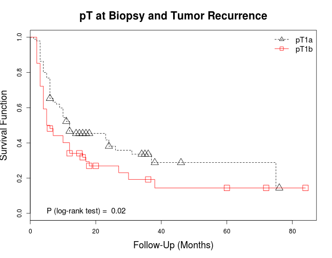

# Cyclin A1 Expression in pT1 Urothelial Carcinoma of Bladder
## Opening & attaching dataset and loading functions & libraries

```r
ca1 <- read.csv("../ca1.csv")
attach(ca1)
library(psych)  # For descriptive statistics
library(survival)  # For Survival Analyses
```

```
## Loading required package: splines
```

```r
source("../standardAnalysis.R")
source("../SurvivalPlot.R")
```

## Describing the Data

```r
# pT1 at Biopsy
table.prop(pt.biopsy)
```

```
##      Count Percentages
## pT1a    95        63.8
## pT1b    54        36.2
```

```r
# CIS at Biopsy
table.prop(cis.biopsy)
```

```
##     Count Percentages
## No    140          94
## Yes     9           6
```

```r
# Initial Treatment
table.prop(treatment)
```

```
##      Count Percentages
## BCG    128        85.9
## MCC      5         3.4
## TURB    16        10.7
```

```r
# Recurrence ratio
table.prop(recurrence)
```

```
##   Count Percentages
## 0    49        32.9
## 1   100        67.1
```

```r
# Distribution of TNM stages
table.prop(dx.final)
```

```
##          Count Percentages
## M1          17        11.4
## pT1         22        14.8
## pT2         20        13.4
## pT3         11         7.4
## pT4          6         4.0
## pTa/pTis    24        16.1
## <NA>        49        32.9
```

```r
# Describing the number of recurrence episodes
descriptive(recurrence.number)
```

```
##        Values
## Mean      2.0
## SD        2.6
## Median    1.0
## IQR       1.0
```

```r
# Recurrence episodes by groups
table.prop(recurrence.groups)
```

```
##      Count Percentages
## 1       59        39.6
## 2       22        14.8
## 3       14         9.4
## >3       5         3.4
## <NA>    49        32.9
```

```r
# Describing the % of cyclin A1 expression
descriptive(ca1.extension)
```

```
##        Values
## Mean      9.1
## SD        6.9
## Median    8.0
## IQR       8.3
```

```r
# % Cyclin A1 Positivity
table.prop(ca1.positive.10)
```

```
##          Count Percentages
## Negative   101        67.8
## Positive    48        32.2
```


# Table 1

```r
# Cyclin A1 by pT at Biopsy
compare.fisher(pt.biopsy, ca1.positive.10)
```

```
## **Table of Frequencies**
##       Column
## Row    Negative Positive
##   pT1a       71       24
##   pT1b       30       24
## 
## **Row Percentages**
##       Column
## Row    Negative Positive
##   pT1a       75       25
##   pT1b       56       44
## 
## **Column Percentages**
##       Column
## Row    Negative Positive
##   pT1a       70       50
##   pT1b       30       50
## 
## Fisher's P value = 0.01864
```

```r
# Cyclin A1 by CIS at Biopsy
compare.fisher(cis.biopsy, ca1.positive.10)
```

```
## **Table of Frequencies**
##      Column
## Row   Negative Positive
##   No        94       46
##   Yes        7        2
## 
## **Row Percentages**
##      Column
## Row   Negative Positive
##   No        67       33
##   Yes       78       22
## 
## **Column Percentages**
##      Column
## Row   Negative Positive
##   No        93       96
##   Yes        7        4
## 
## Fisher's P value = 0.7189
```

```r
# Cyclin A1 by Recurrence
compare.fisher(recurrence, ca1.positive.10)
```

```
## **Table of Frequencies**
##    Column
## Row Negative Positive
##   0       33       16
##   1       68       32
## 
## **Row Percentages**
##    Column
## Row Negative Positive
##   0       67       33
##   1       68       32
## 
## **Column Percentages**
##    Column
## Row Negative Positive
##   0       33       33
##   1       67       67
## 
## Fisher's P value = 1
```

```r
# Cyclin A1 by Progression
compare.fisher(progression, ca1.positive.10)
```

```
## **Table of Frequencies**
##    Column
## Row Negative Positive
##   0       73       22
##   1       28       26
## 
## **Row Percentages**
##    Column
## Row Negative Positive
##   0       77       23
##   1       52       48
## 
## **Column Percentages**
##    Column
## Row Negative Positive
##   0       72       46
##   1       28       54
## 
## Fisher's P value = 0.00325
```

```r
# Adjusting P value using Hommel's correction
table1.raw <- c(0.01864, 0.7189, 1, 0.00325)
table1.hommel <- p.adjust(table1.raw, method = c("hommel"))
table1.adjusted <- cbind(table1.raw, table1.hommel)
matrix(data = table1.adjusted, nrow = 4, ncol = 2, dimnames = list(c("pT at Biopsy", 
    "CIS at Biopsy", "Recurrence", "Progression"), c("Raw P values", "Adjusted P values")))
```

```
##               Raw P values Adjusted P values
## pT at Biopsy       0.01864           0.05592
## CIS at Biopsy      0.71890           1.00000
## Recurrence         1.00000           1.00000
## Progression        0.00325           0.01300
```


## Estimating Survival Functions for Tumor Recurrence

```r
# Defining survival object
surv.recurrence <- with(ca1, Surv(time.event, recurrence))
# pT1 and recurrence
pt1.recurrence <- survfit(surv.recurrence ~ pt.biopsy, data = ca1)
# CIS and recurrence
cis.recurrence <- survfit(surv.recurrence ~ cis.biopsy, data = ca1)
# Initial treatment and recurrence
treatment.recurrence <- survfit(surv.recurrence ~ treatment, data = ca1)
# Cyclin A1 and recurrence
ca1.recurrence <- survfit(surv.recurrence ~ ca1.positive.10, data = ca1)
```


### pT Biopsy and Tumor Recurrence (Figure 2A)

```r
# Log-rank test
survdiff(surv.recurrence ~ pt.biopsy)
```

```
## Call:
## survdiff(formula = surv.recurrence ~ pt.biopsy)
## 
##                 N Observed Expected (O-E)^2/E (O-E)^2/V
## pt.biopsy=pT1a 95       59     69.3      1.53      5.43
## pt.biopsy=pT1b 54       41     30.7      3.46      5.43
## 
##  Chisq= 5.4  on 1 degrees of freedom, p= 0.0198
```

```r
# Survival curves
survival.plot(x = pt1.recurrence, title = "pT at Biopsy and Tumor Recurrence", 
    p = 0.02, levels = c("pT1a", "pT1b"))
```

 


### CIS and Tumor Recurrence (Figure 2B)

```r
# Log-rank test
survdiff(surv.recurrence ~ cis.biopsy)
```

```
## Call:
## survdiff(formula = surv.recurrence ~ cis.biopsy)
## 
##                  N Observed Expected (O-E)^2/E (O-E)^2/V
## cis.biopsy=No  140       95    92.47     0.069     0.999
## cis.biopsy=Yes   9        5     7.53     0.848     0.999
## 
##  Chisq= 1  on 1 degrees of freedom, p= 0.318
```

```r
# Survival curves
survival.plot(x = cis.recurrence, title = "CIS at Biopsy and Tumor Recurrence", 
    p = 0.32, levels = c("Absent", "Present"))
```

 


### Initial Treatment and Tumor Recurrence (Figure 2C)

```r
# Log-rank test
survdiff(surv.recurrence ~ treatment)
```

```
## Call:
## survdiff(formula = surv.recurrence ~ treatment)
## 
##                  N Observed Expected (O-E)^2/E (O-E)^2/V
## treatment=BCG  128       89    84.88     0.200     1.446
## treatment=MCC    5        3     3.63     0.111     0.124
## treatment=TURB  16        8    11.48     1.057     1.307
## 
##  Chisq= 1.5  on 2 degrees of freedom, p= 0.473
```

```r
# Survival curves
survival.plot(x = treatment.recurrence, title = "Initial Treatment at Biopsy and Tumor Recurrence", 
    p = 0.47, levels = c("TURB+BCG", "TURB+MC", "TURB alone"))
```

 


### Cyclin A1 and Tumor Recurrence (Figure 2D)

```r
# Log-rank test
survdiff(surv.recurrence ~ ca1.positive.10)
```

```
## Call:
## survdiff(formula = surv.recurrence ~ ca1.positive.10)
## 
##                            N Observed Expected (O-E)^2/E (O-E)^2/V
## ca1.positive.10=Negative 101       68     69.8    0.0472     0.171
## ca1.positive.10=Positive  48       32     30.2    0.1093     0.171
## 
##  Chisq= 0.2  on 1 degrees of freedom, p= 0.68
```

```r
# Survival curves
survival.plot(x = ca1.recurrence, title = "Cyclin A1 and Tumor Recurrence", 
    p = 0.68, position = "topright", levels = c("Negative", "Positive"))
```

 


### Tumor Recurrence (All Figures Combined)

```r
par(mfrow = c(2, 2))
# Figure 2A
survival.plot(x = pt1.recurrence, title = "pT at Biopsy and Tumor Recurrence", 
    p = 0.02, levels = c("pT1a", "pT1b"))
# Figure 2B
survival.plot(x = cis.recurrence, title = "CIS at Biopsy and Tumor Recurrence", 
    p = 0.32, levels = c("Absent", "Present"))
# Figure 2C
survival.plot(x = treatment.recurrence, title = "Initial Treatment at Biopsy and Tumor Recurrence", 
    p = 0.47, levels = c("TURB+BCG", "TURB+MC", "TURB alone"))
# Figure 2D
survival.plot(x = ca1.recurrence, title = "Cyclin A1 and Tumor Recurrence", 
    p = 0.68, position = "topright", levels = c("Negative", "Positive"))
```

 


## Estimating Survival Functions for Tumor Progression

```r
# For tumor progression
surv.progression <- with(ca1, Surv(time.event, progression))
# pT1 and progression
pt1.progression <- survfit(surv.progression ~ pt.biopsy, data = ca1)
# CIS and progression
cis.progression <- survfit(surv.progression ~ cis.biopsy, data = ca1)
# Initial treatment and progression
treatment.progression <- survfit(surv.progression ~ treatment, data = ca1)
# Cyclin A1 and progression
ca1.progression <- survfit(surv.progression ~ ca1.positive.10, data = ca1)
```


### pT at Biopsy and Tumor Progression (Figure 2E)

```r
# Log-rank test
survdiff(surv.progression ~ pt.biopsy)
```

```
## Call:
## survdiff(formula = surv.progression ~ pt.biopsy)
## 
##                 N Observed Expected (O-E)^2/E (O-E)^2/V
## pt.biopsy=pT1a 95       21     37.2      7.05      23.7
## pt.biopsy=pT1b 54       33     16.8     15.61      23.7
## 
##  Chisq= 23.7  on 1 degrees of freedom, p= 1.11e-06
```

```r
# Survival curves
survival.plot(x = pt1.progression, title = "pT at Biopsy and Tumor Progression", 
    p = 1.11e-06, levels = c("pT1a", "pT1b"))
```

 


### CIS at Biopsy and Tumor Progression (Figure 2F)

```r
# Log-rank test
survdiff(surv.progression ~ cis.biopsy)
```

```
## Call:
## survdiff(formula = surv.progression ~ cis.biopsy)
## 
##                  N Observed Expected (O-E)^2/E (O-E)^2/V
## cis.biopsy=No  140       54    50.02     0.317      4.48
## cis.biopsy=Yes   9        0     3.98     3.981      4.48
## 
##  Chisq= 4.5  on 1 degrees of freedom, p= 0.0343
```

```r
# Survival curves
survival.plot(x = cis.progression, title = "CIS at Biopsy and Tumor Progression", 
    p = 0.03, levels = c("Absent", "Present"), position = "bottomright")
```

 


### Initial Treatment and Tumor Progression (Figure 2G)

```r
# Log-rank test
survdiff(surv.progression ~ treatment)
```

```
## Call:
## survdiff(formula = surv.progression ~ treatment)
## 
##                  N Observed Expected (O-E)^2/E (O-E)^2/V
## treatment=BCG  128       49    45.88     0.213     1.482
## treatment=MCC    5        1     1.97     0.475     0.513
## treatment=TURB  16        4     6.16     0.756     0.895
## 
##  Chisq= 1.5  on 2 degrees of freedom, p= 0.47
```

```r
# Survival curves
survival.plot(x = treatment.progression, title = "Initial Treatment and Tumor Progression", 
    p = 0.47, levels = c("TURB+BCG", "TURB+MC", "TURB alone"))
```

 


### Cyclin A1 and Tumor Progression (Figure 2H)

```r
# Log-rank test
survdiff(surv.progression ~ ca1.positive.10)
```

```
## Call:
## survdiff(formula = surv.progression ~ ca1.positive.10)
## 
##                            N Observed Expected (O-E)^2/E (O-E)^2/V
## ca1.positive.10=Negative 101       28     37.5      2.41      8.24
## ca1.positive.10=Positive  48       26     16.5      5.49      8.24
## 
##  Chisq= 8.2  on 1 degrees of freedom, p= 0.0041
```

```r
# Survival curves
survival.plot(x = ca1.progression, title = "Cyclin A1 and Tumor Progression", 
    p = 0.004, levels = c("Negative", "Positive"))
```

 


### Tumor Progression (All Figures Combined)

```r
par(mfrow = c(2, 2))
# Figure 2E
survival.plot(x = pt1.progression, title = "pT at Biopsy and Tumor Progression", 
    p = 1.11e-06, levels = c("pT1a", "pT1b"))
# Figure 2F
survival.plot(x = cis.progression, title = "CIS at Biopsy and Tumor Progression", 
    p = 0.03, levels = c("Absent", "Present"), position = "bottomright")
# Figure 2G
survival.plot(x = treatment.progression, title = "Initial Treatment and Tumor Progression", 
    p = 0.47, levels = c("TURB+BCG", "TURB+MC", "TURB alone"))
# Figure 2H
survival.plot(x = ca1.progression, title = "Cyclin A1 and Tumor Progression", 
    p = 0.004, levels = c("Negative", "Positive"), text(x = 40))
```

```
## Error: invalid coordinate lengths
```

 


## Estimating Hazard Ratios for Tumor Recurrence
cox.pt1.recurrence <- coxph(surv.recurrence ~ pt.biopsy, data = ca1) # pT1 and recurrence
cox.cis.recurrence <- coxph(surv.recurrence ~ cis.biopsy, data = ca1) # CIS and recurrence
cox.treatment.recurrence <- coxph(surv.recurrence ~ treatment, data = ca1) # Initial treatment and recurrence
cox.ca1.recurrence <- coxph(surv.recurrence ~ ca1.positive.10, data = ca1) # Cyclin A1 and recurrence
cox.ca1pt1.recurrence <- coxph(surv.recurrence ~ ca1.positive.10 + pt.biopsy, data = ca1) # Cyclin A1 & pT1 at Biopsy and recurrence


## Estimating Hazard Ratios for Tumor Progression
cox.pt1.progression <- coxph(surv.progression ~ pt.biopsy, data = ca1) # pT1 and progression
cox.cis.progression <- coxph(surv.progression ~ cis.biopsy, data = ca1) # CIS and progression
cox.treatment.progression <- coxph(surv.progression ~ treatment, data = ca1) # Initial treatment and progression
cox.ca1.progression <- coxph(surv.progression ~ ca1.positive.10, data = ca1) # Cyclin A1 and progression
cox.ca1pt1.progression <- coxph(surv.progression ~ ca1.positive.10 + pt.biopsy, data = ca1) # Cyclin A1 & pT1 at Biopsy and progression

# Table 2
# Tumor Recurrence
summary(cox.pt1.recurrence) # pT1 and recurrence
summary(cox.cis.recurrence) # CIS and recurrence
summary(cox.treatment.recurrence) # Treatment and recurrence
summary(cox.ca1.recurrence) # Cyclin A1 and recurrence
summary(cox.ca1pt1.recurrence) # Cyclin A1 & pT1 and recurrence
# Tumor Progression
summary(cox.pt1.progression) # pT1 and progression
summary(cox.cis.progression) # CIS and progression
summary(cox.treatment.progression) # Treatment and progression
summary(cox.ca1.progression) # Cyclin A1 and progression
summary(cox.ca1pt1.progression) # Cyclin A1 & pT1 and progression
# Evaluating the interaction between pT1 and Cyclin A1
cox.ca1bypt1.progression <- coxph(surv.progression ~ ca1.positive.10*pt.biopsy, data = ca1) 
summary(cox.ca1bypt1.progression)
# Comparison of Model 1 (only pT1) vs. Model 2 (pT1 + Cyclin A1)
# vs. Model 3 (only Cyclin A1) for tumor progression
anova(cox.pt1.progression, cox.ca1pt1.progression) # Model 1 vs. Model 2
anova(cox.ca1.progression, cox.ca1pt1.progression) # Model 3 vs. Model 2
